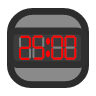

#   TaTimer

Timer inspired by the old 30/30 timer app. Without that timeboxing/pomodoro/time-tracker app I wouldn't have gotten through college because of my undiagnosed ADHD at the time, so I recreated it as an homage and for my own personal use (it easily quadruples my output per measure of effort).

This was made with Svelte + Typescript, vite, and specific features were implemented with moment, svelte-dnd-action and worker-timers. The first version of this was made with React, but I chose to rewrite because of the developer ergonomics of Svelte.

## How to install/use

If you want to build it yourself, just clone the repo, run ```npm install && npm run build`` then serve the /dist folder (eg. ```npx serve /dist``` ).

Or you can just go to https://tati.codes/timer/

## What's New?
  - Svelte!
  - New feature: Responsive<sup>sort of</sup> design now makes it easier to use on phone screens!
  - New feature: PWA / Add To Home functionality
  - New feature: Native notifications.
  - New feature: Low graphics mode for older devices.
  - New feature: Gesture support!
      - <u>long press</u> to <u>edit</u> a task
      - <u>swipe left</u> to send a task to the <u>bottom</u>
      - <u>swipe right</u> to <b>delete</b> a task
      - <u> two finger tap</u>  to send a task to the <u> top</u> 
      - <u> three finger tap</u>  to <u> copy</u>  a task
      - <u> drag</u>  a task by <u> the ⋮⋮ handle</u>  to reorder
  - New Feature: It's just prettier now :)
  - New Feature: Screen WakeLock toggle, so you can leave the timer open without worrying about your screen going off. Not available specifically on iOS PWA. It does work in safari, though.
  - New Feature: Keyboard Navigation!
    - FIXME: Tab behaviour in the Task Edit screen does not follow ARIA standards yet
  - Upcoming feature: Obsidian plugin version as soon as it is accepted.
  - Warning IOS **⚠** : 
    - "TaskList cleared" sound not available in iOS. 